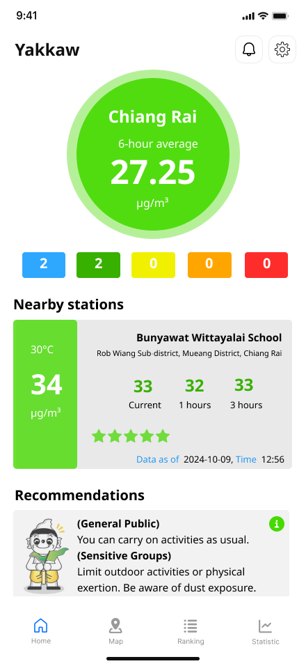
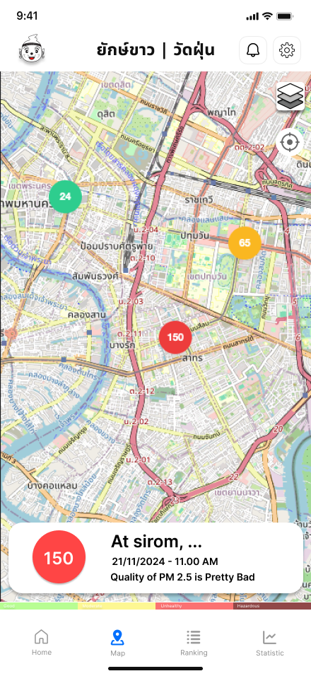
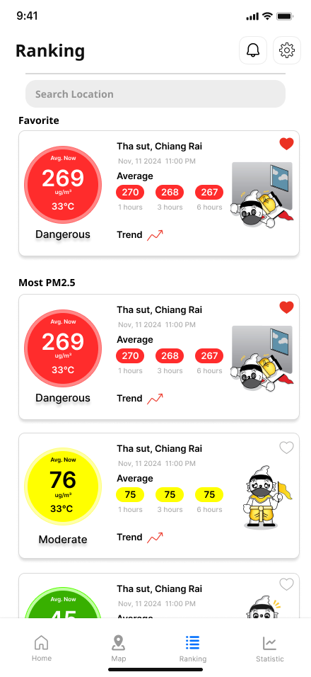
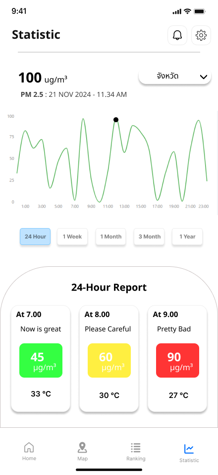

# Yakkaw Mobile Application

<p align="center">
  
</p>

> **สมาคมยักษ์ขาว** ก่อตั้งขึ้นเพื่อเป็นตัวกลางในการตรวจติดตามปัญหาฝุ่นควันของประเทศไทย โดยเริ่มต้นจากจังหวัดเชียงราย และเครือข่ายจังหวัดในภาคเหนือ พร้อมทั้งแจกจ่ายอุปกรณ์วัดค่าฝุ่นเพื่อแจ้งเตือนประชาชนในพื้นที่ ในการเตรียมพร้อมรับมือ ตามหลักการธงสุขภาพ เพื่อสุขภาพอันดีของประชาชนชาวไทย ภายใต้สถานการณ์ฝุ่นควันพิษในอากาศ **PM2.5**

---

## 📱 About Yakkaw
Yakkaw is a modern mobile application designed to monitor air pollution issues in Thailand, starting from Chiang Rai and expanding to northern provinces. It provides **real-time PM2.5 air quality data**, interactive maps, and health-based recommendations.

## 🚀 Features
✅ **Real-time PM2.5 air quality monitoring**  
🔔 **Instant air pollution alerts**  
📍 **Interactive pollution heatmaps**  
🏥 **Health recommendations based on AQI levels**  
📊 **Statistics and ranking of air quality data**

---

## 🛠️ Tech Stack
| **Category** | **Technology** |
|-------------|---------------|
| **Frontend** | React Native |
| **Backend** | Node.js, Go(Echo) |
| **Database** | MySQL, Firebase Firestore |
| **APIs & Services** | Various External APIs |

---

## 📥 Installation

### Prerequisites
- Install [Node.js, Xcode, Android Studio, etc.]
- Install necessary dependencies

### Steps
```sh
# Clone the repository
git clone https://github.com/franz1us/Yakkaw-Mobile-Application.git

# Navigate to the project directory
cd Yakkaw-Mobile-Application

# Install dependencies
npm install  # or yarn install

# Run the app
 npm start --reset-cache  # or react-native run-android
```

---

## 📸 Screenshots
<p align="center">
  
  
  
  
</p>

---

## 👥 Contributors
- [Phumiphat Wongsathit](https://github.com/franz1us) - _Project manager_
- [Klavivach Prajong](https://github.com/MABiuS1) - _FullStack_
- [Ramet Naochompoo](https://github.com/6531503120) - _Frontend_
- [Manatsanan Thepkaew](https://github.com/manatsananthepkaew) - _Frontend_

---

## 📝 License
This project is licensed under the [MIT License](LICENSE).

---

## 📬 Contact
📧 **Email:** [6531503117@lamduan.mfu.ac.th]  
🐙 **GitHub Issues:** [Open an issue](https://github.com/franz1us/Yakkaw-Mobile-Application/issues)

